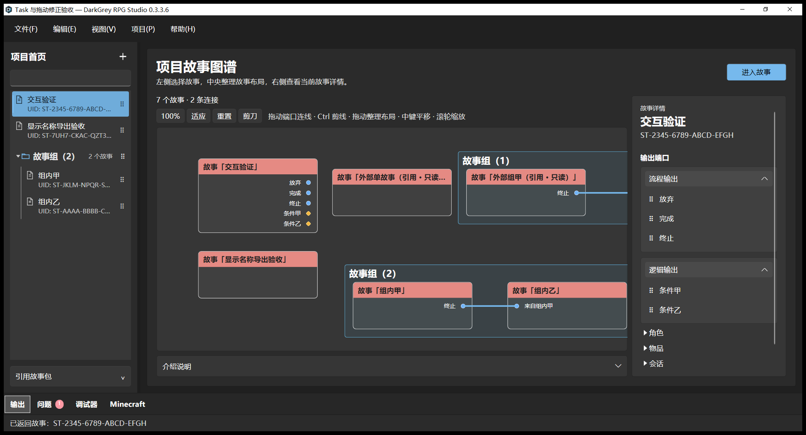
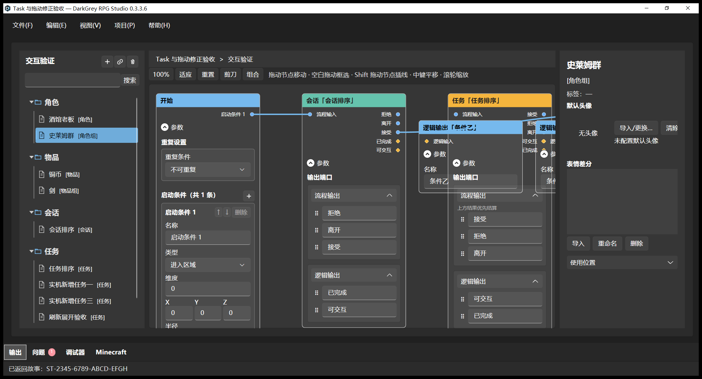

# 目录树统一、侧栏字号和固定名称导出

日期：2026-10-05。版本保持 **0.3.3.6**。本轮完成 Story 资源库与 Project 故事树样式统一，并根据追加截图放大两处侧栏字体；同时修正单故事及故事组导出窗口。工作区改动保留，未提交、推送、创建成品包或发布。当前字号和导出行为 **USER_ACCEPTED=NO**；用户已经认可的目录树风格作为本轮设计依据，不能代替当前程序的用户验收。

## 最终表现

- 两处侧栏共用 `DirectoryTreeStyles.xaml`：文件夹标题 **16 DIP、SemiBold**，故事／资源名称 **14 DIP、正常字重**，UID、类型和数量等辅助文字 **12 DIP**。文件夹明确大于内部文件；保留深浅主题颜色、长名称省略和完整名称提示。
- Story 资源库采用同一文件夹／文档图标、20 DIP 缩进、细层级导线、整行折叠和行选择高亮。角色、角色组、物品、物品组、会话、任务标签仍为中文，资源条目及工具提示不显示资源 UID。Project 的故事辅助 UID 沿用既有规则。
- 保留资源选择、双击打开、右键菜单、资源拖放及只读规则；分类折叠使用现有 220ms 动画。资源分类标题仍指定新建／引用的类别，沿用原有分类选择语义；项目故事组保留既有折叠及排序交互。
- 单故事导出名固定为 **故事显示名称 + `.dgrs`**，故事组固定为 **组显示名称 + `.dgrs.g`**。改为原生文件夹选择窗口，标题显示实际文件名，没有文件名输入框。用户仅选择保存目录。
- 名称中的 Windows 非法字符替换为下划线，处理保留设备名、末尾点／空格及过长名称；不以 UID 替代显示名称。包内稳定身份不变。
- 目标文件存在时保持默认“否”的覆盖确认；拒绝后返回文件夹选择，取消不写包。目录选择仍按既有设置保存。
- 项目 UI skill 已记录上述树形目录规范和 **16／14／12 DIP** 层级，供后续目录结构优先复用。既有相邻项让位式拖动排序规范保留。

## 自动测试

证据目录：`evidence/ResourceTreeExport`。最终源码的相关 WPF 回归 **125 通过、0 失败、0 跳过**；完整 Core **496 通过、0 失败、0 跳过**；完整 WPF **683 通过、0 失败、1 跳过**，跳过项为默认未启用的 `FixedThreeHundredNodeWorkload` 性能基准。见 `TestCounts.json`、`Tests/*.trx` 和对应日志。

覆盖共享目录模板、动画展开、选择和现有资源操作，显示名称传入单故事／故事组路径选择器，以及中文、非法字符、Windows 保留名称、空名称和长名称的文件名处理。完整套件同时检查现有图、端口、资源及历史操作。UI skill 通过 `quick_validate.py` 校验。

本轮未修改 Java、数据格式或 Runtime 执行规则，未重新运行 Minecraft／Java 套件；沿用已验证 Runtime JAR，其字节和哈希保持不变。此前轮次的 Runtime 验证按原报告保留。

## 代理原生实机

使用 Windows UI Automation 和 Win32，复用隔离候选 `.tooling/0336-ui-followup/Studio` 及其 Data。最终截图使用应用窗口 `PrintWindow`，不依赖桌面叠层画面。

- 最终字体在深浅主题均复核。Project 的组标题大于成员与独立故事；Story 资源树包含六类标签。实际点击资源，检查选中高亮及对应 Inspector；点击分类标题文字和空白展开／收起；双击会话进入其编辑视图。
- 实际缩窄 Story 左栏到最小宽度附近，检查文件夹、图标、资源名与中文类型的可读性；长条目按现有省略规则显示。截图见 `19-final-resource-light.png`、`21-resource-selected-dark.png`、`22-resource-folder-collapsed.png`、`24-resource-doubleclick-session.png`、`26-resource-narrow-dark.png`。
- 原生导出文件夹窗口标题明确显示固定文件名，下方只有目录选择；见 `10-single-folder-picker.png`、`12-group-folder-picker.png`。有效单故事生成 `Exports/显示名称导出验收.dgrs`（1,695 字节），故事组生成 `Exports/故事组（2）.dgrs.g`（54,839 字节、2 个成员），Studio 完成导出后校验。ZIP manifest 核对：文件名来自显示名称，单故事包内部仍使用稳定 Story UID，故事组保留原成员身份。见 `ExportArchives.json`、`ExportManifestProof.json`。
- 实际重复选择已有单故事的目标目录，覆盖确认默认焦点位于“否”；发送原生 IDNO 后返回文件夹选择。原包大小、SHA-256 和修改时间均未改变，随后取消窗口。见 `OverwriteFinal.json`、`OverwriteConfirmUIA.json`。
- 首次尝试导出隔离项目原有的“交互验证”时，已有测试 Task 的空目标说明被正常校验拒绝（`graph.objective.description.invalid`），未生成部分包。后续使用独立有效故事完成上述导出验收；没有改写该草稿来绕过校验。
- 本轮未重新实机穷举全部资源拖入参数框；既有拖放事件入口保留，相关回归及完整 WPF 套件通过。代理检查不能替代用户对字号和操作的实际验收。

## 权威交付

通过 `studio/package-studio.ps1` 更新 **`dist/DarkGreyRPGStudio/DarkGreyRPGStudio.exe`**。验收候选和 dist 的 EXE、Studio DLL、Core DLL 逐字节一致。程序白名单缺失 **0**，根目录只保留 apphost EXE。权威 EXE 实际启动、恢复原项目、没有异常对话框，正常关闭；见 `DistSmoke.json` 和 `27-authoritative-launch.png`。

| 文件 | ProductVersion | 字节数 | SHA-256 |
| --- | --- | ---: | --- |
| `DarkGreyRPGStudio.exe` | 0.3.3.6 | 204288 | `8e8bf253b16b1516616d890b8bd604a907cf9d607469e3785d4ab113a5b3b20c` |
| `Program/DarkGreyRPGStudio.dll` | 0.3.3.6 | 1748480 | `8ed26a64b7dc0fdceb8e51611aafeb903bf5126d1b8292286136001680822648` |
| `Program/DarkGreyRPG.Studio.Core.dll` | 1.0.0+99a3253d7186127bdbe37898824ecbd32219f136 | 1304064 | `870616ef7abbedfb33d72338e5e4909e7d58a55a4ca670fb36a98a0fba665899` |
| `dist/darkgrey_rpg-0.3.3.6.jar`（沿用） | 0.3.3.6 | 1953317 | `b41b414285f9e28d96ebddd64825ddc4690220b53648d69711ac4bb5ee1a5798` |

apphost EXE 的哈希保持不变；本轮 UI 和导出修改体现在 Studio DLL。完整交付核对见 `DeliveryProof.json`。

本轮部署前 Data 基线为 **2,655 文件、64,203,495 字节**。部署后及权威 EXE 启动关闭后，逐文件比较相对路径、大小和 SHA-256，差异均为 **0**。见 `DataPostLaunch.json`；原始逐文件清单保留于 `.tooling/0336-ui-followup/ResourceTreeExport/DataBefore.json` 与 `DataAfter.json`。

6 个确认已不用的本轮发布中间目录以及 2 张废弃截图，共 **3,563,366,878 字节**，已送入回收站。来源路径消失，8 个回收站负载均存在；没有清空回收站，没有处理历史未知目录、工作区源码、候选 Data 或用户项目。见 `RecycleBefore.json`、`RecycleProof.json`。回收站仍占空间，不将上述大小称为磁盘已释放容量。

当前交付以本报告及 `Delivery.json` 为准，旧报告保留其当轮证据。用户尚未验收本轮最终字号和固定名称导出。
