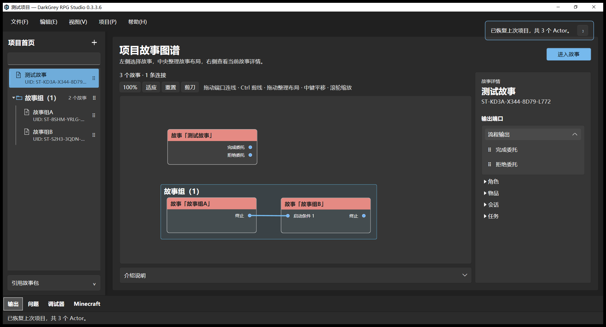

# Project 故事树同级对齐与成员缩进

日期：2026-10-05。版本保持 **0.3.3.6**。独立故事与故事组标题处于同一级，组内故事再向右缩进一级。本轮只调整项目故事树行的布局，并将对齐规范补充到 UI skill；此前目录样式、16／14／12 DIP 字号和 Story 内部资源库保持现有实现。当前修改 **USER_ACCEPTED=NO**，代理检查与用户验收分别记录。

## 最终表现

- 独立故事的图标与故事组文件夹图标对齐，故事名称与组标题文字起点对齐。文件行预留文件夹展开箭头列的空间。
- 组内故事沿用 20 DIP 成员缩进及 1 DIP 层级导线，图标与名称比同级顶层项向右约 21 DIP；选中背景和右侧排序手柄保持现有宽度与位置。
- 修改位置为 `studio/src/DarkGreyRPG.Studio/Views/DirectoryTreeStyles.xaml` 的 `StoryNavigationItemStyle`，左侧 Padding 从 8 DIP 调整为 19 DIP。不修改故事组成员关系、顺序、稳定身份、图连线、折叠与拖动处理。
- `.agents/skills/studio-node-ui/SKILL.md` 已补充“同级文件夹与独立文件的图标和名称分别对齐，组内文件再缩进一级”的规范；通过 skill 校验。

## 自动测试

当前源码运行 `StoryNavigationViewModelTests` 和 `StoryGroupView0336Tests`：**26 通过、0 失败、0 跳过**。证据为 `evidence/SidebarIndent/SidebarIndent.trx`、`Related.log`。这是布局修正的相关回归；本轮未重新运行完整 Core、WPF 或 Java 套件。上一轮完整 Core 496 通过、WPF 683 通过／1 个默认未启用基准跳过的证据仍在 `ResourceTreeExportAcceptance.md`，不计作本轮新结果。Runtime JAR 未修改或重建。

## 代理原生实机

使用 Windows UI Automation、Win32 输入与应用窗口 `PrintWindow`，在复用的隔离候选 `.tooling/0336-ui-followup/Studio` 中检查深浅主题。候选程序与权威程序的 EXE、Studio DLL、Core DLL 哈希一致。

- 当前窗口 DPI 为 119（缩放约 1.2396）。两个主题中，独立故事名称起点 X=71，组标题起点约 X=70.823，误差小于 1 个物理像素；两个成员名称起点均为 X=97，比顶层向内约 20.975 DIP。
- 独立故事位置来自 UI Automation 的可见文本 Bounds；组标题文字未单独暴露 UIA peer，使用其原生 Toggle Bounds 与模板的 padding／展开列／图标列计算起点，应用截图另行目视确认图标和名称对齐。详见 `NativeChecks.json`。
- 点击标题文字折叠并重新展开，选中组成员的 RuntimeId 保持相同，重新展开后仍选中“组内甲”。Inspector 区域折叠前后像素差异 **0**，图中对应节点保持选中；见 `02-dark-member-selected.png`、`03-dark-collapsed.png`、`04-light-member-selected.png`。
- 初始检查脚本用折叠后选中项的子文本来判定身份，隐藏项的子文本不再暴露，产生一次探针误判；修正为选中项 RuntimeId、重新展开后的名称与 Inspector 像素比较，所有检查通过。原始探针记录留在 `.tooling/0336-ui-followup/SidebarIndent/NativeChecksInitialProbe.json`，未因此改动应用逻辑。
- 权威 EXE 实际启动恢复用户原项目，窗口标题为“测试项目 — DarkGrey RPG Studio 0.3.3.6”，没有异常窗口，正常关闭、退出码 0。见 `DistSmoke.json` 和上方截图。

本轮未穷举此前完整目录交互矩阵，未将代理实机检查标记为用户认可。当前缩进规则尚待用户使用验收。

## 权威交付与数据

通过 `studio/package-studio.ps1` 更新 **`dist/DarkGreyRPGStudio/DarkGreyRPGStudio.exe`**。程序白名单 405 项，缺失 0，根目录只有 apphost EXE。

| 文件 | ProductVersion | 字节数 | SHA-256 |
| --- | --- | ---: | --- |
| `DarkGreyRPGStudio.exe` | 0.3.3.6 | 204288 | `8e8bf253b16b1516616d890b8bd604a907cf9d607469e3785d4ab113a5b3b20c` |
| `Program/DarkGreyRPGStudio.dll` | 0.3.3.6 | 1748480 | `5d0bdc86ae509b0991e80f6fee1c5de1ce837e38a2ed727c13e531196220e3a1` |
| `Program/DarkGreyRPG.Studio.Core.dll` | 1.0.0+99a3253d7186127bdbe37898824ecbd32219f136 | 1304064 | `870616ef7abbedfb33d72338e5e4909e7d58a55a4ca670fb36a98a0fba665899` |
| `dist/darkgrey_rpg-0.3.3.6.jar`（沿用） | 0.3.3.6 | 1953317 | `b41b414285f9e28d96ebddd64825ddc4690220b53648d69711ac4bb5ee1a5798` |

apphost EXE 哈希不变，本轮样式改动体现在 Studio DLL。完整核对见 `DeliveryProof.json`。

本轮部署前重新建立 Data 基线：**2,661 文件、64,211,962 字节**。部署后及权威 EXE 启动关闭后，逐文件相对路径、大小和 SHA-256 差异均为 **0**。原始清单为 `.tooling/0336-ui-followup/SidebarIndent/DataBefore.json` 与 `DataAfter.json`；不使用上一轮的 2,655 文件基线代替。

确认不用的本轮 4 个发布中间目录，共 **2,374,277,478 字节**，已送入回收站。删除前核对路径、无目录链接、无 Data、当前 Studio DLL 哈希及本轮创建清单；来源路径消失，4 个回收负载存在。没有清空回收站，回收站仍占磁盘空间。此前未知暂存、候选 Data 和工作区改动保留，未创建成品包或发布。

最新交付以本报告和 `Delivery.json` 为准，历史报告保留其当轮结果。
