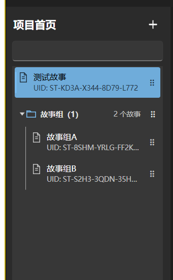

# 故事组侧栏目录样式修正

后续更新：两处侧栏现已统一并放大为文件夹 16、名称 14、辅助文字 12 DIP；当前程序校验值及导出修复见 [ResourceTreeExportAcceptance.md](ResourceTreeExportAcceptance.md)。下文保留本轮当时的 12／13／11 DIP 设计与证据。

日期：2026-10-05。版本保持 **0.3.3.6**。本轮仅调整 Project 故事侧栏的视觉模板，保留已有工作区改动；未提交、推送、创建成品包或发布。`USER_ACCEPTED=NO`。

## 最终表现

- 移除包住组标题和成员的卡片外框、圆角和内边距，改为紧凑的树状目录。
- 故事组使用折叠箭头、主题强调色文件夹图标、12 DIP 半粗标题及较淡的故事数量。标题整行仍可折叠，拖动手柄独立处理，右键改名保持可用。
- 故事使用文档图标、13 DIP 正常字重名称及 11 DIP 辅助 UID。成员相对独立故事缩进，左侧细竖线标明归属；独立故事保持顶层对齐。
- 选中态只作用于故事行，使用主题高亮和左侧色条；文字、图标、UID 随选中态和深浅主题使用对应前景色。名称过长时省略，悬停显示全名。
- 组成员、故事图连线、端口、元数据模型和 Runtime 规则没有改变。画布故事组框继续保留；整组排序、撤销、220ms 折叠及双击进入故事沿用原有行为。

下图直接截自更新后的权威 EXE，没有改动用户项目内容：

## 验证

证据目录：`evidence/StorySidebar`。

- 最终 Release 构建后运行 `StoryNavigationViewModelTests` 和 `StoryGroupView0336Tests`：**26 通过、0 失败、0 跳过**。见 `sidebar-final-related.log`、`sidebar-final-related.trx`。此次是纯 XAML 样式调整，未重复运行 Core、Java 或完整 WPF 套件；前轮完整结果仍按原轮次记录。
- 使用 Windows UI Automation 和 Win32，在复用的隔离候选目录实际点击标题文字、空白、三角和拖动手柄。折叠前后选中故事的 UIA 身份相同，Inspector 指定区域 **104,300 个像素中变化 0**。
- 实际拖动标题，将整个组移至独立故事之前，成员随组移动；一次 Undo 恢复顺序，组仍展开。右键改成长组名并撤销，名称存储恢复；Home／End 导航和双击打开故事完成读回。
- `native-checks.json` **15 项全部为 true**；辅助脚本 `VerifySidebar.py` 根据 UIA 边界、选中项身份、Inspector 图像对比、实际工作区入口及组名称文件核对。
- 人工检查深浅主题、选中／未选中、展开／收起、225 物理像素宽的窄列表及长组名。相应截图为 `sidebar-dark-selected.png`、`sidebar-light-selected.png`、`sidebar-dark-narrow.png`、`sidebar-light-narrow.png`、`sidebar-long-group-name.png`。
- 在含大量角色的隔离故事首次打开时曾捕获短暂“未响应”，随后进入工作区；该未稳定截图没有作为成功视觉证据。本轮没有修改资源加载过程或宣称大量资源打开性能已验收。最终双击入口验收使用正常进入组内甲后的 `sidebar-story-doubleclick-ready.png` 和 `native-doubleclick-check.json`。

代理实机核对不等于用户验收。本轮没有重新运行 Minecraft 客户端或服务器。

## 交付与数据保留

使用 `studio/package-studio.ps1` 更新唯一候选和权威 `dist/DarkGreyRPGStudio/DarkGreyRPGStudio.exe`，实际启动权威 EXE 并正常关闭。候选与 dist 的 Studio DLL 哈希相同；405 项程序白名单文件齐全，程序根目录只保留启动 EXE。

| 文件 | ProductVersion | 字节数 | SHA-256 |
| --- | --- | ---: | --- |
| `dist/DarkGreyRPGStudio/DarkGreyRPGStudio.exe` | 0.3.3.6 | 204288 | `8E8BF253B16B1516616D890B8BD604A907CF9D607469E3785D4AB113A5B3B20C` |
| `Program/DarkGreyRPGStudio.dll` | 0.3.3.6 | 1744896 | `AD85DF9270E8A5E2946C858365C607894341165D80CBD39A593A355A45272F17` |

Runtime 未改动，沿用前轮已验证的 `build/libs/darkgrey_rpg-0.3.3.6.jar`，SHA-256 为 `B41B414285F9E28D96EBDDD64825DDC4690220B53648D69711AC4BB5EE1A5798`。宿主 EXE 哈希不变，样式更新位于 Program 中的 Studio DLL。

本轮更新前的 Data 基线为 **2,655 个文件、64,203,495 字节**。更新及权威程序启动关闭后，按相对路径、大小及 SHA-256 比较，**差异为 0**。此基线与前轮不同，保留本轮开始时用户已有的新增内容；没有用旧基线覆盖 Data。见 `delivery.json`，原始逐文件基线保留在 `.tooling/0336-ui-followup/StorySidebar/data-before.json`。

本轮 6 个已不用的发布暂存目录、**3,561,394,713 字节（约 3.56 GB）**已送入回收站。每个目标先核对为 `.tooling/wpf-build` 的直接子目录，无链接、无 Data、无运行程序；来源消失且回收站对应负载全部存在。保留早期未知用途目录、候选 Data 和测试证据，没有清空回收站，也不把回收站占用称为已释放空间。见 `recycle-result.json`。

当前文件校验值以本报告和 `Delivery.json` 为准；旧报告保留其当轮证据。
